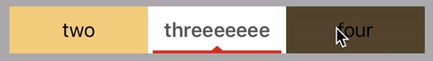

# HSegmentControl
[](https://travis-ci.org/popodidi/HSegmentControl)
[](http://cocoapods.org/pods/HSegmentControl)
[](http://cocoapods.org/pods/HSegmentControl)
[](http://cocoapods.org/pods/HSegmentControl)

A customized segment control sublassing UIControl where the view, titles of each segment and the indicator view can all be cutomized.

### Features

- [x] Customized configuration
	- `@IBInspectable`Title color
	- `@IBInspectable`Indicator image
	- `@IBInspectable`Number of displayed segments 
	- Title font
	- Indicator view
- [x] DataSource protocol
	- Number of segments
	- Segment background view (optional)
- [x] Documentation

### Demo




## Example

To run the example project, clone the repo, and run `pod install` from the Example directory first.


## Installation

HSegmentControl is available through [CocoaPods](http://cocoapods.org). To install
it, simply add the following line to your Podfile:

```ruby
pod "HSegmentControl"
```

Swift version | version
---- | ----
2.3 | 2.0.x
3.0 | 2.1.0 or later

## Usage

### Add to View

You can either add `HSegmentControl` programmatically with code

``` swift
let segmentControl = HSegmentControl()
view.addSubview(segmentControl)
// Customized configuration
// .
// .
// .
```

or simply drag and drop an UIView in storyboard (Interface Builder) and set the class to `HSegmentControl`.

### Data source protocol
Make sure your controller implements the `HSegmentControlDataSource` protocol and is set to the `dataSource` of the `HSegmentControl`

```swift
class ViewController: UIViewController, HSegmentControlDataSource{
	// .
	// .
	// .
	override func viewDidLoad(){
		super.viewDidLoad()	
		segmentControl.dataSource = self
		//.
		//.
		//.
	}
	// .
	// .
	// .
	// MARK: - HSegmentControlDataSource protocol
    func numberOfSegments(segmentControl: HSegmentControl) -> Int {
        return 5
    }
    
    func segmentControl(segmentControl: HSegmentControl, titleOfIndex index: Int) -> String {
        return ["1","two", "threeeeeee", "four", "five"][index]
    }
    
    // Optional
    func segmentControl(segmentControl: HSegmentControl, segmentBackgroundViewOfIndex index: Int) -> UIView {
        let view = UIView()
        view.backgroundColor = UIColor(red: CGFloat(drand48()), green: CGFloat(drand48()), blue: CGFloat(drand48()), alpha: 1)
        return view
    }
}
```

### Configure HSegmentControl
```swift
override func viewDidLoad(){
	super.viewDidLoad()
	segmentControl.dataSource = self
	//.
	//.
	//.
	// Customized configuration
	segmentControl.numberOfDisplayedSegments = 3
	segmentControl.selectedTitleFont = UIFont.boldSystemFontOfSize(17)
	segmentControl.selectedTitleColor = UIColor.darkGrayColor()
	segmentControl.unselectedTitleFont = UIFont.systemFontOfSize(17)
	segmentControl.unselectedTitleColor = UIColor.blackColor()
	segmentControl.segmentIndicatorImage = UIImage(named: "ind_img")
	segmentControl.segmentIndicatorViewContentMode = UIViewContentMode.Bottom
	segmentControl.segmentIndicatorView.backgroundColor = UIColor.whiteColor()
}
```

### Value changed
As you did in any other `UIControl`, link the `valueChanged` functions to delegate action when value changed.

```swift
@IBAction func valueChanged(sender: AnyObject){
	print("value did change to \((sender as! HSegmentControl).selectedIndex)")
}
```

### Change value manually
Simply set the `selectedIndex` variable

```swift
segmentControl.selectedIndex = 2
```
Note that function `valueChanged(sender:)` will not be called when you set `selectedIndex` manually.

## Author

Hao


## License

HSegmentControl is available under the MIT license. See the LICENSE file for more info.
